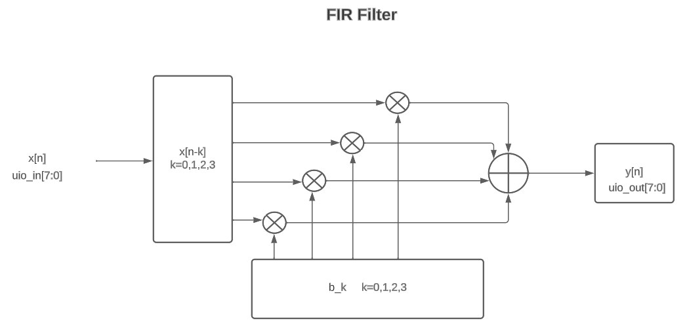

  


# Tiny Tapeout FIR Filter

Un filtro FIR se define matemáticamente como:
```math
$$ y_{n}=\sum _{k=0}^{N-1}b_{k}x_{n-k} $$
```
lo cual se puede expresar alternativamente como:

```math
 y[n]  = b_{0}x[n]+b_{1}x[n-1]+\cdots +b_{N}x[n-N]\\
     = \sum _{i=0}^{N}b_{i}\cdot x[n-i]
```
Este circuito cuenta con capacidad de 4 coeficientes de 5 bits cada uno. 
Entrada de 8 bits y salida de 8 bits.

Los coeficientes se pueden asignar utilizando los switches (ui_in) con ui_in[2:1] seleccionamos cual de los 4 coeficientes cambiar. Con ui_in[0] habilitamos para que pueda cambiar dicho coeficiente. Y ui_in[7:3] indica el coeficiente que se va asignar.
Cuando rst_n está en 0, se asignan ceros a las entradas pasadas y 1s a los coeficientes.

La entrada x[n] se pasa al circuito con la entrada uio_in. 
La salida y[n] se obtiene con uio_out.
La entrada x[n] se toma en cada ciclo de reloj y se calcula la salida y[n] utilizando los coeficientes y las ultimas 4 entradas (filtro de 4 coeficientes).

La salida uo_out correspondiente a al display de 7 segmentos se está utilizando para colocar el valor de salida y[n].

Este diagrama muestra casi la totalidad del circuito:




# What is Tiny Tapeout?

TinyTapeout is an educational project that aims to make it easier and cheaper than ever to get your digital designs manufactured on a real chip!

## How to enable the GitHub actions to build the ASIC files

Please see the instructions for:

- [Enabling GitHub Actions](https://tinytapeout.com/faq/#when-i-commit-my-change-the-gds-action-isnt-running)
- [Enabling GitHub Pages](https://tinytapeout.com/faq/#my-github-action-is-failing-on-the-pages-part)

## How does it work?

When you edit the info.yaml to choose a different ID, the [GitHub Action](.github/workflows/gds.yaml) will fetch the digital netlist of your design from Wokwi.

After that, the action uses the open source ASIC tool called [OpenLane](https://www.zerotoasiccourse.com/terminology/openlane/) to build the files needed to fabricate an ASIC.

